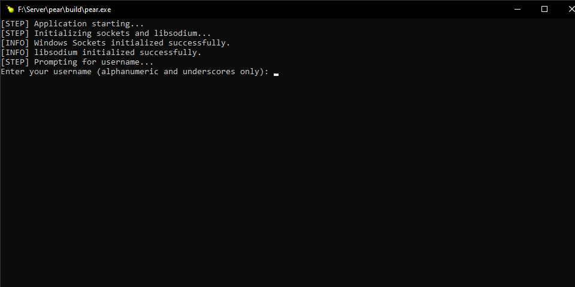

# pear

**pear** is an open-source, terminal-based, decentralized, peer-to-peer encrypted chat platform for one-on-one communication. It enables **fully private** conversations across **Windows, Linux, and macOS** by using advanced, ephemeral encryption with no central servers and no stored logs.

Pear leverages:
- **End-to-end encryption with Libsodium** – Dynamically generated, ephemeral keys for every session.
- **Dynamic, ephemeral connection keys** – Each connection is uniquely secured.
- **Zero logs – Ever.** – No data is stored or persisted, ensuring total privacy.
- **Robust error handling and secure input routines** – Enhancing reliability.
- **Multi-threaded architecture** – Simultaneous sending and receiving for real-time chat.
- **A minimalist command-line interface** – Streamlined for one-on-one interactions.
- **Automatic reconnection prompts** – If a client disconnects or is rejected, it is prompted to retry or enter new connection parameters.
- **Persistent server listening** – When a connection is rejected, the server continues to listen for new incoming connections.



---

## Current Features

### Zero-Logging Policy
Pear does not store any logs—neither in memory nor on disk. All sensitive data, including ephemeral encryption keys and connection metadata, are securely wiped after each session. This ensures **absolute privacy and security**.

### Decentralized, One-on-One Chat
Unlike traditional chat platforms, Pear does not rely on any central servers. Instead, it establishes **direct peer-to-peer** connections, preventing any third party from intercepting or logging communications.

### Secure Ephemeral Key Exchange
Pear utilizes **Triple Diffie-Hellman key exchange** to securely negotiate encryption keys between peers. This ensures that every session has a unique key, and once the session ends, the keys are **permanently discarded**.

### Strong End-to-End Encryption
- **Encryption Algorithm:** ChaCha20-Poly1305 AEAD
- **Message Authentication:** Poly1305 MAC ensures message integrity
- **Key Derivation:** HKDF using BLAKE2b

### Robust Error Handling and Secure Input
Pear ensures error-free execution with:
- Secure input handling using `safe_fgets`
- Reliable message transmission with `send_all`
- Immediate cleanup of invalid sessions to prevent crashes

### Multi-Threaded Send/Receive Architecture
Pear employs a **multi-threaded design**, allowing concurrent message sending and receiving. This ensures **real-time, low-latency communication**.

### Built-in Command Set
Pear provides a minimal yet powerful command set:
- `/help` – Display available commands
- `/clear` – Clear the terminal screen
- `/status` – Show connection status (local and remote IP, usernames, and ports)
- `/ping` – Send a ping message (remote peer responds with a pong)
- `/disconnect` – Terminate the session immediately
- `/exit` – Gracefully close the chat session

### Automatic Reconnection Prompt (Client-Side)
If a client fails to connect, Pear prompts:
```
[INPUT] Type 'r' to retry or 'n' to enter a new IP/port:
```
This allows users to **reconnect without restarting** the application.

### Persistent Server Listening
When a connection is rejected, the server **remains active**, continuously listening for new clients.

### Cross-Platform Compatibility
Pear is **fully supported on Windows, Linux, and macOS**, with platform-specific socket and threading implementations.

### CMake-Based Build System
Pear uses **CMake** for easy cross-platform compilation and dependency management.

---

## Technical Details

### Cryptographic Key Exchange
Pear implements **Triple Diffie-Hellman (TDH) key exchange**, ensuring **perfect forward secrecy**. The process is as follows:

1. **Ephemeral Key Generation**
   - Each peer generates **two ephemeral key pairs**.

2. **Diffie-Hellman Computations**
   - Three DH operations are performed:
     - `DH1 = crypto_scalarmult(local_eph1_sk, remote_eph1_pk)`
     - `DH2 = crypto_scalarmult(local_eph1_sk, remote_eph2_pk)`
     - `DH3 = crypto_scalarmult(local_eph2_sk, remote_eph1_pk)`
   - The three DH outputs are concatenated into a **96-byte shared secret**.

3. **Key Derivation**
   - The shared secret is hashed using **BLAKE2b**.
   - Unique session keys are derived as follows:
     - **Server:**
       - Receive Key (`rx_key`) = `H(master_secret, "c2s")`
       - Transmit Key (`tx_key`) = `H(master_secret, "s2c")`
     - **Client:**
       - Transmit Key (`tx_key`) = `H(master_secret, "c2s")`
       - Receive Key (`rx_key`) = `H(master_secret, "s2c")`

### Message Encryption
- **Algorithm:** ChaCha20-Poly1305 AEAD
- **Nonce Handling:** A random 12-byte nonce is prepended to each message
- **Authentication:** Poly1305 ensures message integrity

### Network Handling
Pear uses **UDP hole punching** to establish direct connections, even when NAT is present. If hole punching fails, the program prompts for retries or new connection details.

### Multi-Threaded Architecture
- **Send Thread:** Reads input, processes commands, encrypts messages, and transmits them.
- **Receive Thread:** Reads, decrypts, and prints incoming messages.
- **Thread Synchronization:** Handled via mutexes and condition variables to prevent race conditions.

### Server & Client Connection Management
- **Server listens indefinitely** for incoming connections.
- **Client retries failed connections** without restarting.

---

## Installation

### Build from Source
```sh
git clone https://github.com/d3a-n/pear
cd pear
cmake -S . -B build
cmake --build build
```

### Manual Compilation Dependencies
#### Windows (MSYS2)
```sh
pacman -S mingw-w64-x86_64-gcc mingw-w64-x86_64-libsodium cmake ninja
```

#### Linux (Debian, Ubuntu, Fedora, Arch, etc.)
```sh
sudo apt install build-essential cmake ninja-build pkg-config
```

#### macOS (Homebrew)
```sh
brew install cmake ninja libsodium
```

---

## Usage
```sh
./pear
```

1. **Enter Username**
2. **Select Mode** (`c` for client, ENTER for server)
3. **Chat Securely**

---

## License
Pear is released under the **MIT License**. See the [LICENSE](LICENSE) file for details.

