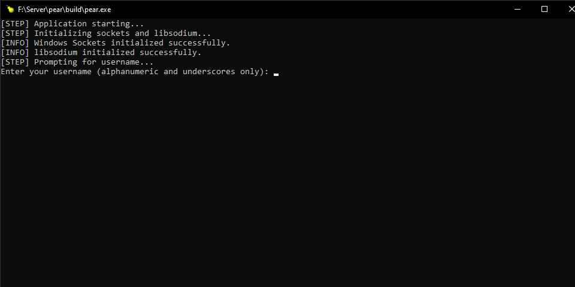

# pear - Fully Encrypted P2P Chat Over I2P

**pear** is a secure, decentralized, peer-to-peer encrypted chat application that operates entirely over the I2P network. It provides strong encryption, anonymity, and censorship resistance, ensuring that no government or adversary can track, intercept, or manipulate communications.



## Features

### End-to-End Encryption
- **Triple Diffie-Hellman (3DH)** key exchange for secure session establishmenthttps://github.com/d3a-n/pear/blob/main/README.md
- **ChaCha20-Poly1305** authenticated encryption for all messages
- **Double Ratchet Algorithm** for perfect forward secrecy
- **HKDF** for secure key derivation

### I2P Network Integration
- **Embedded I2PD daemon** for seamless I2P connectivity
- **SAM API** for I2P tunnel management
- **No outproxies** - stays 100% inside I2P to prevent traffic leaks
- **Username-based connections** with decentralized lookup

### Connection Privacy
- **Connection approval** - Server must approve incoming connections
- **No persistent trusted peers** - No stored contact information
- **Y/N confirmation prompt** - Explicitly approve each connection request
- **Connection rejection** - Securely reject unwanted connections

### Anti-Traffic Analysis
- **Random message padding** to prevent size-based tracking
- **Randomized message timing** to avoid timing correlation
- **Dummy traffic generation** to obscure real messages
- **No cleartext metadata** - all data is fully encrypted

### Secure Exit Handling
- **Retract I2P tunnels** on exit
- **Wipe encryption keys from RAM** using `sodium_memzero`
- **Delete temporary session data** securely
- **Ensure nothing is recoverable** after exit

### Command System
- `/help` - Display available commands
- `/cl` - Clear the terminal screen
- `/pg` - Test connection latency
- `/dc` - Disconnect from the current peer
- `/rr` - Refresh I2P routes and tunnels

## Building from Source

### Prerequisites
- CMake 3.10 or higher
- C++17 compatible compiler
- libsodium
- I2PD (or system I2P router)

### Build Instructions

#### Linux
```bash
# Install dependencies
sudo apt install build-essential cmake libsodium-dev i2pd

# Clone the repository
git clone https://github.com/yourusername/pear.git
cd pear

# Build
mkdir build && cd build
cmake ..
make
```

#### macOS
```bash
# Install dependencies
brew install cmake libsodium i2pd

# Clone the repository
git clone https://github.com/yourusername/pear.git
cd pear

# Build
mkdir build && cd build
cmake ..
make
```

#### Windows (MSYS2)
```bash
# Install dependencies
pacman -S mingw-w64-x86_64-gcc mingw-w64-x86_64-cmake mingw-w64-x86_64-libsodium

# Clone the repository
git clone https://github.com/yourusername/pear.git
cd pear

# Build
mkdir build && cd build
cmake -G "MSYS Makefiles" ..
make
```

## Usage

1. Start the application:
   ```
   ./pear
   ```

2. Enter your username (alphanumeric or underscores)

3. Choose to run as a server (press ENTER) or client (press 'c')

4. If running as a client, enter the username of the peer you want to connect to

5. If running as a server, you'll receive connection requests with a prompt to accept (y) or reject (n)

6. Start chatting securely!

## Security Considerations

- All encryption keys are stored only in RAM and wiped on exit
- No logs or message history are stored
- All communications stay within the I2P network
- No persistent trusted peers database - all connections must be explicitly approved
- Random padding and dummy traffic help prevent traffic analysis
- The application automatically handles secure exit when terminated

## License

This project is licensed under the GNU GPLv3 License - see the [LICENSE](LICENSE) file for details.
